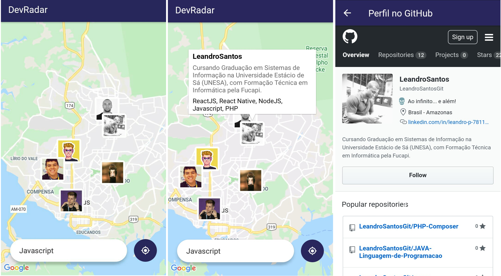

<h1 align="center">
    
</h1>

<h4 align="center">
   Projeto <strong>DevRadar</strong> desenvolvido durante a Semana OmniStack 10.0 da Rocketseat
</h4>
<p align="center">
  
  
</p>

## Projeto

Projeto desenvolvido na semana-omnistack-10 da [Rocketseat](https://rocketseat.com.br/). O DevRadar é uma aplicação que encontra desenvolvedores numa determinada localização. Esses desenvolvedores são filtrados por tecnologias que o usuário insere no campo de busca e a aplicação exibe os devs filtrados em até 10km. 
A aplicação web e mobile possuem comunicação em tempo real com o backend, assim quando há uma alteração nos dados, ambas as plataformas são atulizadas. A aplicação web foi desenvolvida utilizando create-react-app e a mobile com a plataforma expo-cli.

Repositório oficial do projeto [semana-omnistack-10](https://github.com/Rocketseat/semana-omnistack-10).

## Web

Na aplicação web cadastra-se um denvolvedor com usuário do GitHub e as tecnologias de seu conhecimento, e atraves da API do GitHub dados do perfil são salvos no DevRadar.


## Mobile

Na aplicação mobile um mapa localiza os desenvolvedores que são buscados por tecnologias de conhecimento, podendo acessar o GitHub para mais informações do desenvolvedor.



## Tecnologias

Esse projeto foi desenvolvido com as seguintes tecnologias:

- [Node.js](https://nodejs.org/en/)
- [React](https://reactjs.org)
- [React-Native](https://facebook.github.io/react-native/)
- [Expo](https://expo.io/)
- [Socket.io](https://socket.io/)
- [Express](https://expressjs.com/pt-br/)
- [Axios](https://www.npmjs.com/package/axios)
- [Cors]()
- [MongoDB Atlas](https://www.mongodb.com/cloud/atlas)

## Instalação

Para executar a aplicação é necessário ter instalado as ferramenbtas a baixo:

* [Npm](https://www.npmjs.com/package/npm/v/6.13.4  "Clique para abrir a página de instalação") na versão `^6.13.4`

* [Node.js](https://nodejs.org/ru/download/releases/  "Clique para abrir a página de instalação") na versão `^12.14.1`

* [Expo](https://docs.expo.io/versions/v36.0.0/get-started/installation/ "Clique para abrir a página de instalação") na versão `~36.0.0`.

#### Backend

Abra o terminal e navegue até o diretório `backend`, e baixe as dependencias da aplicação executando os comados a baixo:
```
$npm install
$npm dev
```
A aplicação utiliza [MongoDB Atlas](https://www.mongodb.com/cloud/atlas) como bando de dados, a URL de conexão foi armazendada na `index.js`, em `mongoose.connect` insira a URL de conexão para o cluster.

#### Web

Abra o terminal e navegue até o diretório `web`, e baixe as dependencias da aplicação executando os comados a baixo:
```
$npm install
$npm start
```

Automaticamente será aberta aplicação web no seu navegador em `localhost:3000`.

Abra a diretório `src/services` e coloque o endereço do seu servidor, no arquivo `api.js` altere a `baseURL`. Exemplo:
```
const api = axios.create({
	baseURL:  "http://192.168.0.134:3333",
});
```

#### Mobile

Abra o terminal e navegue até o diretório `mobile`, e baixe as dependencias da aplicação executando os comados a baixo:
```
$npm install
$npm start
```
Automaticamente será aberta no seu navegador a página localhost:19002. Conecte no emulador, ou teste o aplicativo por LAN: baixe o aplicativo Expo da Play Store ou App Store e em seguida escaneie o código QR. Está aplicação foi executado em um dispositivo Android Versão 6.0.1.

Abra a diretório `src/services` e coloque o endereço do seu servidor, no arquivo `api.js` altere a `baseURL`, e no arquivo `socket.js` altere o `socketio`, utilizando o número IPV4 da sua conexão com a porta 3333. Exemplo:
```
const api = axios.create({
	baseURL:  "http://192.168.0.134:3333",
});

const socket = socketio('http://192.168.0.134:3333', {
    autoConnect: false,
});
```

## Vídeos

O canal do Filipe Deschamps no Youtube lançou vídeos durante a semana resumindo em detalhes tudo que rolou na Semana OminStack #9 [Playlist](https://www.youtube.com/playlist?list=PLMdYygf53DP67p5x4OyvR9LPMkLkhga_n)

## Licença

Esse projeto está sob a licença MIT. Veja o arquivo [LICENSE](LICENSE.md) para mais detalhes.